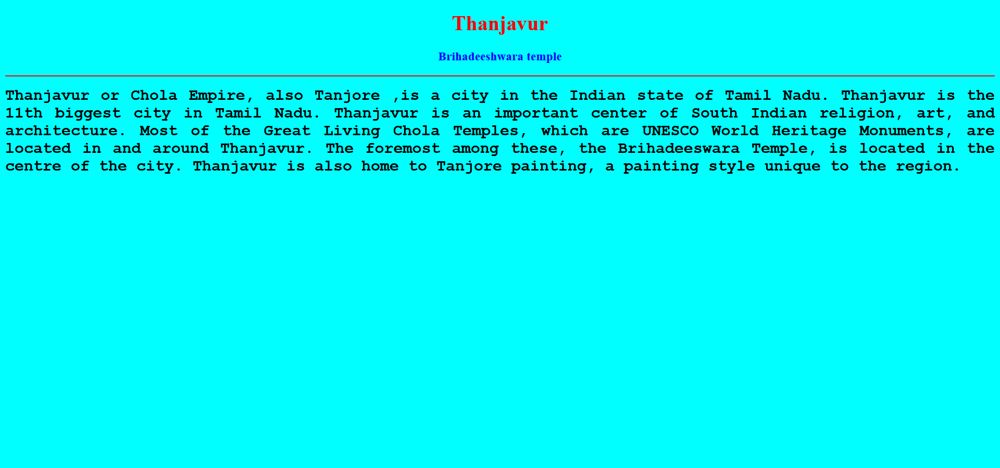
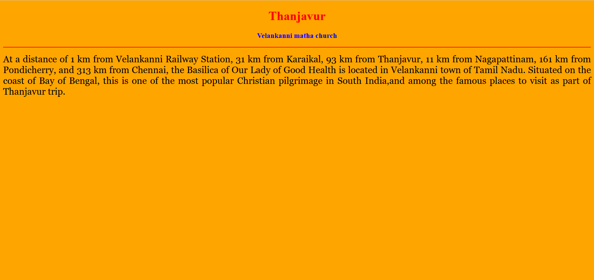
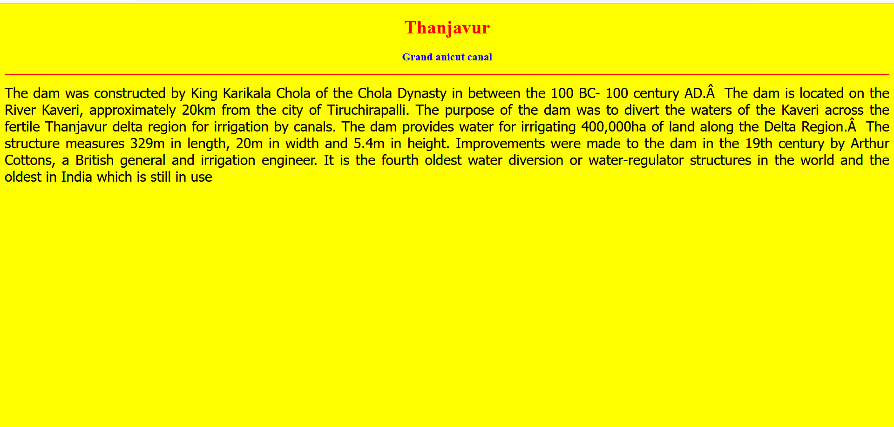
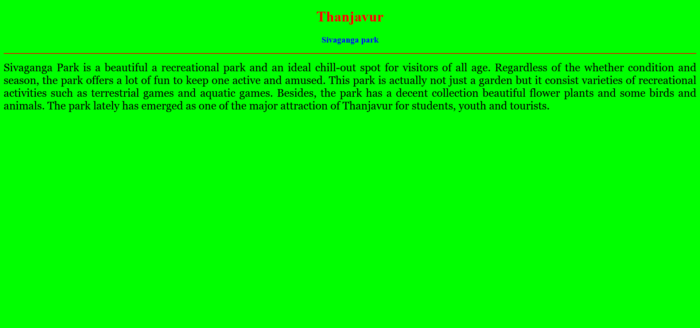
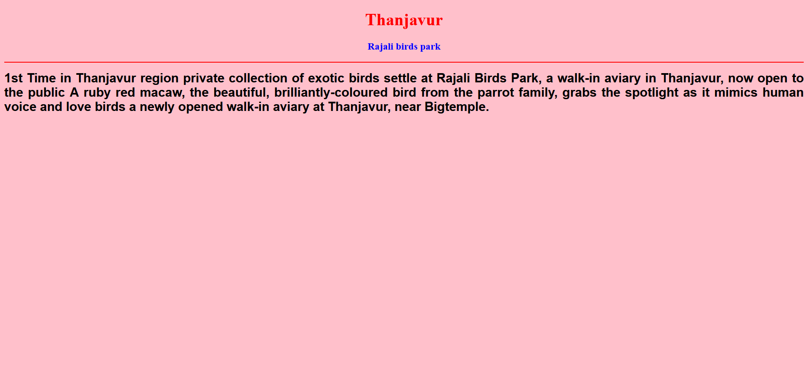
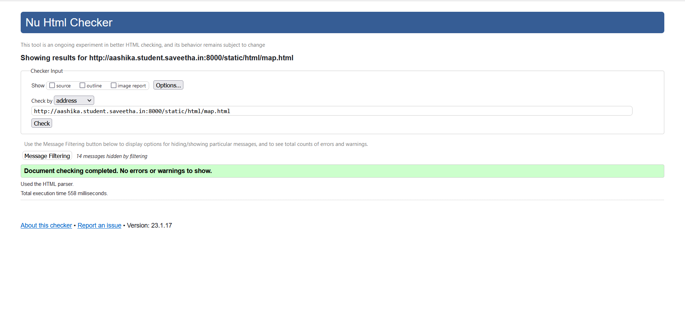

# Places Around Me
## AIM:
To develop a website to display details about the places around my house.

## Design Steps:

### Step 1:
Clone the github repository into Theia IDE.

### Step 2:
Create a new django project.

### Step 3:
write the needed html code.

### Step 4:
Run the Django server and execute the html files.

## Code:
```
map.html
<!DOCTYPE html>
<html lang="en">
<head>
<title>My City</title>
</head>
<body>
<h1 align="center">
<font color="red"><b>Thanjavur</b></font>
</h1>
<h3 align="center">
<font color="blue"><b>Aashika R (22009315)</b></font>
</h3>
<center>

<map name="MyCity">
<area shape="circle" coords="400,300,50" href="/static/html/bird.html" title="Rajali birds park">
<area shape="rectangle" coords="230,30,260,60" href="/static/html/canal.html" title="Grand anicut canal">
<area shape="circle" coords="400,350,50" href="/static/html/church.html" title="vellakanni chrurch">
<area shape="circle" coords="400,200,75" href="/static/html/park.html" title="Shivaganga park">
<area shape="rectangle" coords="490,150,870,320" href="/static/html/temple.html" title="Brihadheeshwara temple">
</map>
</center>
</body>
</html>

bird.html
<!DOCTYPE html>
<html lang="en">
<head>
<title>Rajali birds park</title>
</head>
<body bgcolor="pink">
<h1 align="center">
<font color="red"><b>Thanjavur</b></font>
</h1>
<h3 align="center">
<font color="blue"><b>Rajali birds park</b></font>
</h3>
<hr size="3" color="red">
<p align="justify">
<font face="Arial" size="5">
<b>
1st Time in Thanjavur region private collection of exotic birds settle at Rajali Birds Park, a
walk-in aviary in Thanjavur, now open to the public A ruby red macaw, the beautiful, 
brilliantly-coloured bird from the parrot family, grabs the spotlight as it mimics human 
voice and love birds a newly opened walk-in aviary at Thanjavur, near Bigtemple.
</b>
</font>
</p>
</body>
</html>

canal.html
<!DOCTYPE html>
<html lang="en">
<head>
<title>Grand anicut canal</title>
</head>
<body bgcolor="yellow">
<h1 align="center">
<font color="red"><b>Thanjavur</b></font>
</h1>
<h3 align="center">
<font color="blue"><b>Grand anicut canal</b></font>
</h3>
<hr size="3" color="red">
<p align="justify">
<font face="Tahoma" size="5">
 The dam was constructed by King Karikala Chola of the Chola Dynasty in between the 100 BC- 100 century AD. 
The dam is located on the River Kaveri, approximately 20km from the city of Tiruchirapalli.
The purpose of the dam was to divert the waters of the Kaveri across the fertile Thanjavur delta region for irrigation by canals.
The dam provides water for irrigating 400,000ha of land along the Delta Region. 
The structure measures 329m in length, 20m in width and 5.4m in height.
Improvements were made to the dam in the 19th century by Arthur Cottons, a British general and irrigation engineer.
It is the fourth oldest water diversion or water-regulator structures in the world and the oldest in India which is still in use
</font>
</p>
</body>
</html>

church.html
<!DOCTYPE html>
<html lang="en">
<head>
<title>Velankanni matha church</title>
</head>
<body bgcolor="orange">
<h1 align="center">
<font color="red"><b>Thanjavur</b></font>
</h1>
<h3 align="center">
<font color="blue"><b>Velankanni matha church</b></font>
</h3>
<hr size="3" color="red">
<p align="justify">
<font face="Georgia" size="5">
At a distance of 1 km from Velankanni Railway Station, 31 km from Karaikal, 93 km from Thanjavur, 
11 km from Nagapattinam, 161 km from Pondicherry, and 313 km from Chennai, the Basilica of Our Lady of Good Health
is located in Velankanni town of Tamil Nadu. Situated on the coast of Bay of Bengal, this is one of the most
popular Christian pilgrimage in South India,and among the famous places to visit as part of Thanjavur trip.
</ol>
</font>
</p>
</body>
</html>

park.html
<!DOCTYPE html>
<html lang="en">
<head>
<title>Sivaganga park</title>
</head>
<body bgcolor="lime">
<h1 align="center">
<font color="red"><b>Thanjavur</b></font>
</h1>
<h3 align="center">
<font color="blue"><b>Sivaganga park</b></font>
</h3>
<hr size="3" color="red">
<p align="justify">
<font face="Georgia" size="5">
Sivaganga Park is a beautiful a recreational park and an ideal chill-out spot for visitors 
of all age. Regardless of the whether condition and season, the park offers a lot of fun to
 keep one active and amused. This park is actually not just a garden but it consist varieties
 of recreational activities such as terrestrial games and aquatic games. Besides, the park has
 a decent collection beautiful flower plants and some birds and animals. The park lately has
emerged as one of the major attraction of Thanjavur for students, youth and tourists.
</font>
</p>
</body>
</html>

temple.html
<!DOCTYPE html>
<html lang="en">
<head>
<title>Thanjavur big temple</title>
</head>
<body bgcolor="cyan">
<h1 align="center">
<font color="red"><b>Thanjavur</b></font>
</h1>
<h3 align="center">
<font color="blue"><b>Brihadeeshwara temple</b></font>
</h3>
<hr size="3" color="red">
<p align="justify">
<font face="Courier New" size="5">
<b>
Thanjavur or Chola Empire, also Tanjore ,is a city in the Indian state of Tamil Nadu. Thanjavur is the 
11th biggest city in Tamil Nadu. Thanjavur is an important center of South 
Indian religion, art, and architecture. Most of the Great Living Chola Temples, 
which are UNESCO World Heritage Monuments, are located in and around Thanjavur. 
The foremost among these, the Brihadeeswara Temple, is located in the centre of the city.
Thanjavur is also home to Tanjore painting, a painting style unique to the region. 
</b>
</font>
</p>
</body>
</html>
```

## Output:












## HTML validator


## Result:
The program for implementing image map is executed successfully